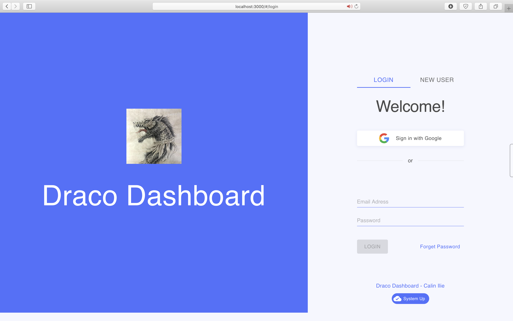
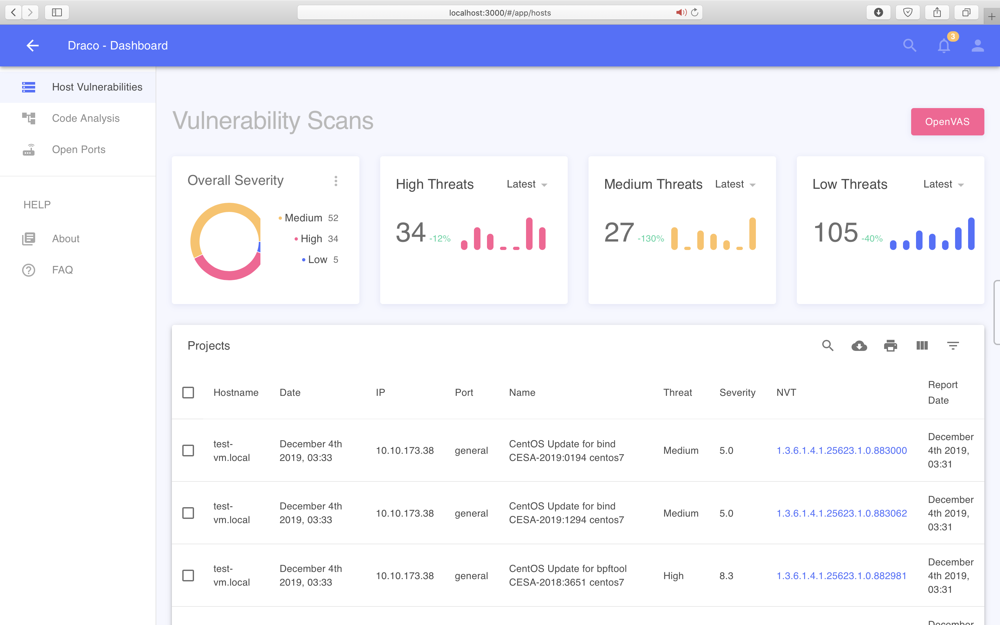
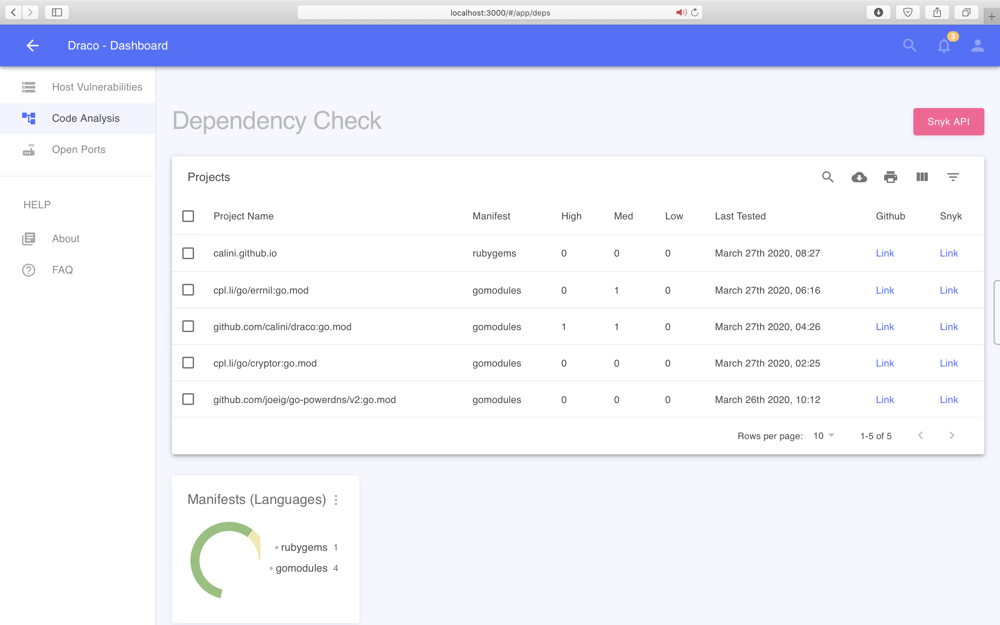
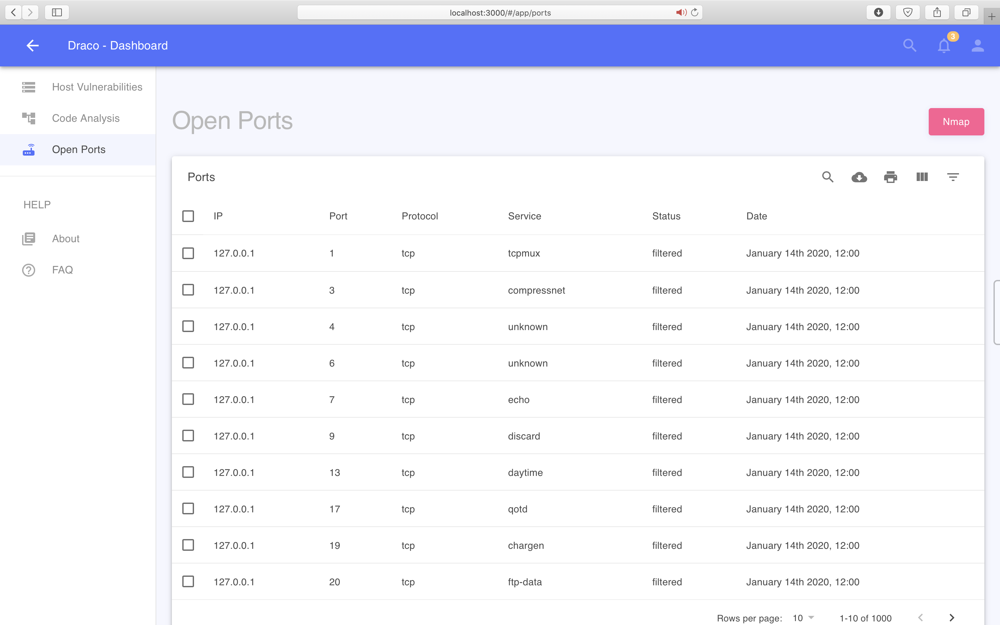
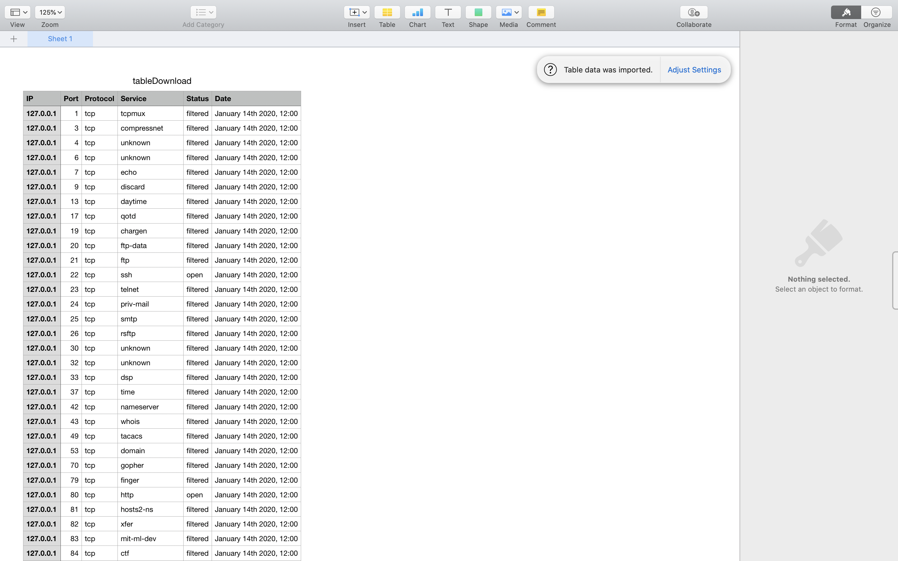

# Draco-Web

[](https://travis-ci.org/calini/draco-web)
[](https://app.fossa.io/projects/git%2Bgithub.com%2Fcalini%2Fdraco-web?ref=badge_shield)

The Web Dashboard for [Project Draco](https://github.com/calini/draco)


Built with [React](https://facebook.github.io/react/), [Material-UI](https://material-ui.com), [React Router](https://reacttraining.com/react-router/).
**No jQuery and Bootstrap!**

## Demo
This demo version has auth off; Please use any credentials to log in.

## Features

- React (**16.8.6**)
- React Hooks
- React Context
- **No jQuery and Bootstrap!**
- Mobile friendly layout (responsive)
- Create-react-app under the hood
- React Router v5
- Material-UI v4
- Modular Architecture
- CSS-in-JS styles
- Webpack build
- Stylish, clean, responsive layout

## Pages

The Dashboard focuses on three main aspects of application security:

#### 1. Login page



#### 2. Dynamic analysis on Hosts



#### 3. Static analysis on Code



#### 4. Network scanning on Ports/Services



#### There are also an About and a FAQ page.


## Exporting Data

You can export data in CSV format from any data table from the main 3 pages, after you have used it's search, sorting or filtering options to create the desired report.


 
## Quick Start

#### 1. Install the dependencies: 
```sh
yarn install
```
#### 2. Run the website: 
```sh
yarn start
```

This runs the app in development mode.

Open http://localhost:3000 to view it in the browser. Whenever you modify any of the source files inside the `/src` folder,
the module bundler ([Webpack](http://webpack.github.io/)) will recompile the
app on the fly and refresh all the connected browsers.

#### 4. Building
```sh
yarn build
```

Builds the app for production to the build folder.
It correctly bundles React in production mode and optimizes the build for the best performance.

The build is minified and the filenames include the hashes.
Your app is ready to be deployed!


## Licensing

[GPL-3](https://github.com/calini/draco-web/blob/master/LICENSE).

[](https://app.fossa.io/projects/git%2Bgithub.com%2Fcalini%2Fdraco-web?ref=badge_large)
